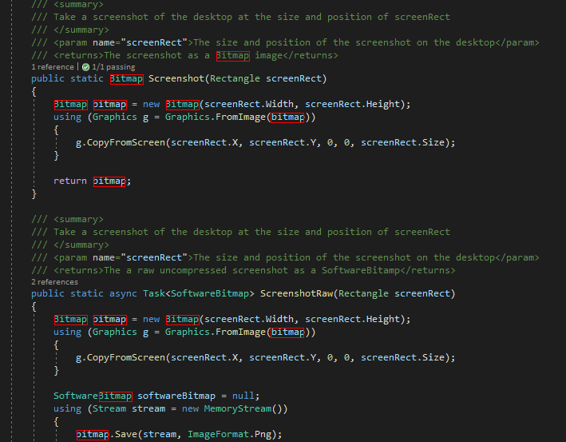

# CMatchOCR

This **.net Standard 2.0 Library** allows you to quickly find the location of words anywhere on the desktop. 



## Features
* [WinRT OCR](https://docs.microsoft.com/en-us/uwp/api/windows.media.ocr.ocrresult?view=winrt-19041) extended to parse words and their associated
 bounding boxes out of the generated text 
* Fuzzy string matching using [FuzzySharp](https://github.com/JakeBayer/FuzzySharp)

## Getting Started
To get started clone the repository and build the project. You can then reference the library DLL from your own .net framework
or .net core project.

```c#
var desktopBounds = Screen.PrimaryScreen.Bounds;
var result = screenTextFinder.FindAll("bitmap", desktopBounds);
// take a screenshot and highlight the results
var bitmap = ScreenshotUtility.Screenshot(desktopBounds);
using(var g = Graphics.FromImage(bitmap)) {
  foreach (var rect in result)
  {
      var r = new Rectangle((int)rect.X, (int)rect.Y, (int)rect.Width, (int)rect.Height);
      g.DrawRectangle(new Pen(Color.Red), r);
  }
}
bitmap.Save(screenshotFilePath, System.Drawing.Imaging.ImageFormat.Png);
```

### Requirements
* Windows 8.1+ (64-bit)
* .net Framework 4.6.1+
* .net Core 3.0+

### Dependencies
* [Microsoft.Windows.SDk.Contracts](https://www.nuget.org/packages/Microsoft.Windows.SDK.Contracts)
* [FuzzySharp](https://github.com/JakeBayer/FuzzySharp)

## Usage
You could get the bounding rectangle for all of the words that match the search word in the area specified by screenRect
on the desktop.
```c#
var result = screenTextFinder.FindAll("searchWord", screenRect);
```
You could get the bounding rectangle for the word which matches the search word and is nearest the center of the area on the 
desktop specified by the screenRect. This is useful for getting the matching word nearest the gaze position when using eye tracking. 
```c#
if (TryFindClosest("searchWord", screenRect, out outputRect))
{
    int x = (int)(outputRect.X + outputRect.Width / 2f);
    int y = (int)(outputRect.Y + outputRect.Height / 2f);
    Cursor.Position = new Point(x, y);
}
```

